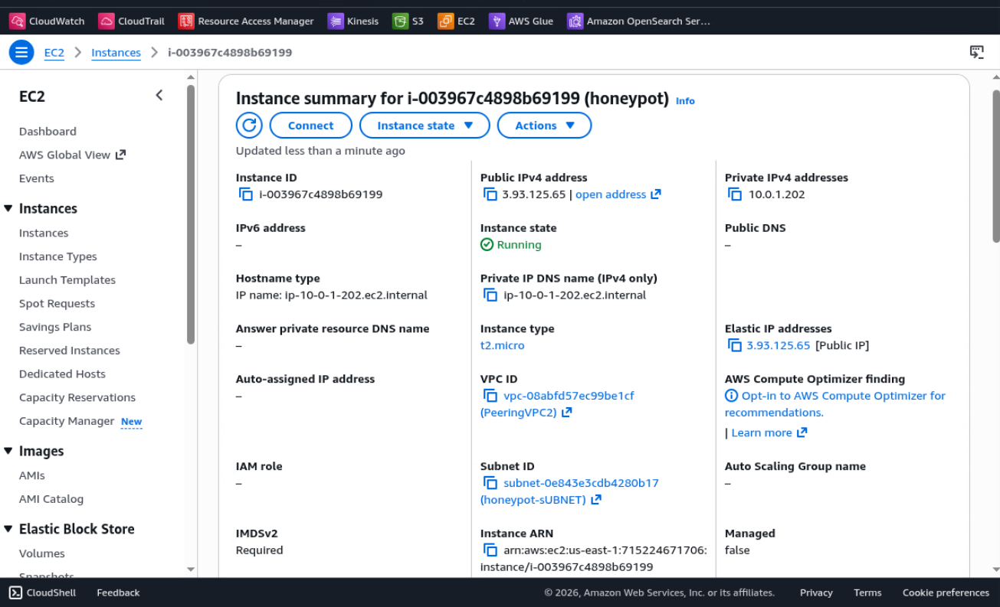
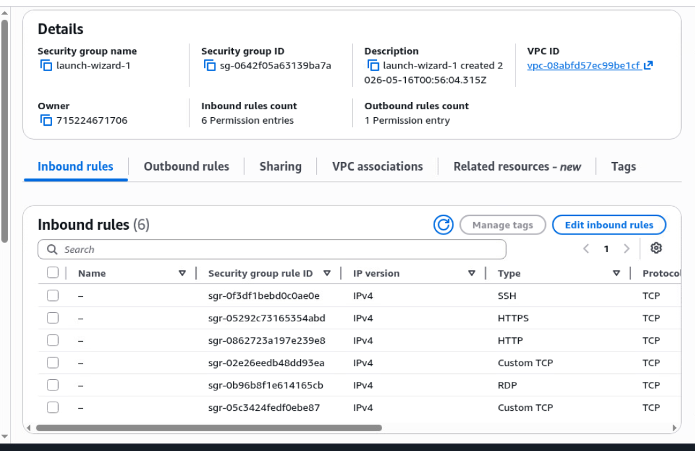
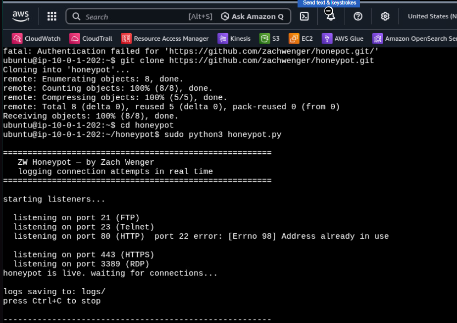
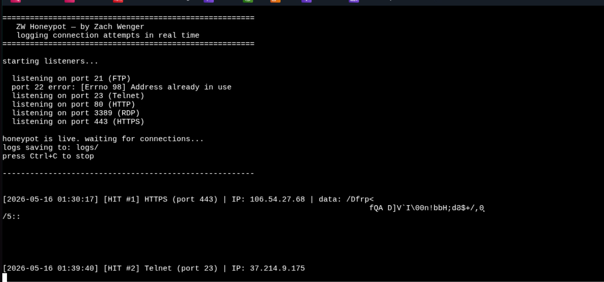
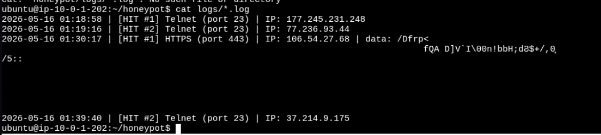

# ZW Honeypot
### by Zach Wenger

A Python honeypot deployed on AWS EC2 that listens on common attack ports and logs real connection attempts from the internet. Built to capture live threat data and understand how attackers actually behave in the wild.

---

## What It Does

Spins up fake listeners on high-value ports — SSH, FTP, Telnet, HTTP, HTTPS, RDP — and logs every connection attempt with timestamp, source IP, port, and any data the attacker sends. Deployed on a public AWS EC2 instance so it's reachable by real internet traffic.

---

## Infrastructure

| Component | Details |
|---|---|
| Cloud Provider | AWS EC2 |
| Instance Type | t2.micro (free tier) |
| OS | Ubuntu Server 22.04 LTS |
| Public IP | 3.93.125.65 |
| Region | US East (N. Virginia) |





---

## Ports Monitored

| Port | Service | Why Attackers Target It |
|---|---|---|
| 21 | FTP | Old file transfer protocol, often misconfigured |
| 22 | SSH | Remote access — bots constantly brute force this |
| 23 | Telnet | Unencrypted remote access, no auth on many IoT devices |
| 80 | HTTP | Web servers — scanned for known vulnerabilities |
| 443 | HTTPS | SSL/TLS exploits, web application attacks |
| 3389 | RDP | Windows remote desktop — ransomware groups love this |

---

## Live Results

The honeypot started receiving hits within minutes of going live. No advertising, no sharing the IP — bots found it automatically by scanning the entire internet.





---

## Captured Connections

| # | Timestamp | Port | Service | Source IP | Data Sent |
|---|---|---|---|---|---|
| 1 | 2026-05-16 01:18:58 | 23 | Telnet | 177.245.231.248 | None |
| 2 | 2026-05-16 01:19:16 | 23 | Telnet | 77.236.93.44 | None |
| 3 | 2026-05-16 01:30:17 | 443 | HTTPS | 106.54.27.68 | Exploit payload |
| 4 | 2026-05-16 01:39:40 | 23 | Telnet | 37.214.9.175 | None |

---

## Threat Analysis

### Attack Patterns

**Telnet scanning (Hits 1, 2, 4)**
Three separate IPs probed port 23 (Telnet) within the first 21 minutes. This is classic automated scanning — bots sweep the entire IPv4 address space looking for open Telnet ports. Telnet is unencrypted and commonly left open on IoT devices, routers, and legacy systems. Once found, attackers attempt default credential logins to gain control of the device. This is how botnets like Mirai recruited millions of IoT devices.

**HTTPS exploit attempt (Hit 3)**
The most interesting hit. IP 106.54.27.68 connected to port 443 and immediately sent raw binary data — not a normal HTTPS handshake. The payload contains non-printable characters consistent with a crafted exploit payload, likely probing for SSL/TLS vulnerabilities or attempting to fingerprint the service. This behavior is typical of automated vulnerability scanners looking for CVEs in web server software.

### Key Findings

- **Time to first hit: under 1 minute** — the internet is actively scanning every public IP constantly
- **Most targeted port: Telnet (23)** — 3 out of 4 hits, consistent with IoT botnet recruitment activity
- **One attacker sent actual exploit data** — not just a probe, an active exploitation attempt
- **All hits were automated** — no human is manually scanning, these are bots running 24/7

### What This Tells Us

This data illustrates why exposed services are dangerous. A real server running Telnet on port 23 would have received brute force login attempts within seconds. The HTTPS payload hit shows that attackers don't just knock on the door — they immediately try to break it down with known exploits.

---

## How to Run It Yourself

```bash
git clone https://github.com/zachwenger/honeypot.git
cd honeypot
sudo python3 honeypot.py
```

Run as root/sudo — ports below 1024 require elevated privileges.

---

## Tech Stack

- Python 3
- `socket` — port listeners
- `threading` — concurrent port monitoring
- `logging` — persistent log files
- `colorama` — terminal output
- AWS EC2 — cloud deployment

---

## What I Learned

The biggest takeaway was how fast the hits came in. Within minutes of a public IP going live, bots were already probing it. This isn't theoretical — it's the actual internet threat landscape running 24/7.

The Telnet hits make sense when you understand the Mirai botnet — it spreads by scanning for open port 23 and trying default credentials. Seeing that same pattern hit my honeypot within minutes of launch made that very real.

The HTTPS payload hit was the most eye-opening. Whoever or whatever sent that wasn't just checking if port 443 was open — it sent crafted binary data immediately. That's an automated exploit scanner doing what it's built to do.

Running this on AWS also taught me how cloud networking actually works — VPCs, subnets, internet gateways, security groups, Elastic IPs. Setting all that up manually made it click in a way that just reading about it never would.

---

*Deployed on AWS EC2 for educational purposes. All data captured is from unsolicited inbound connections to a public IP.*
