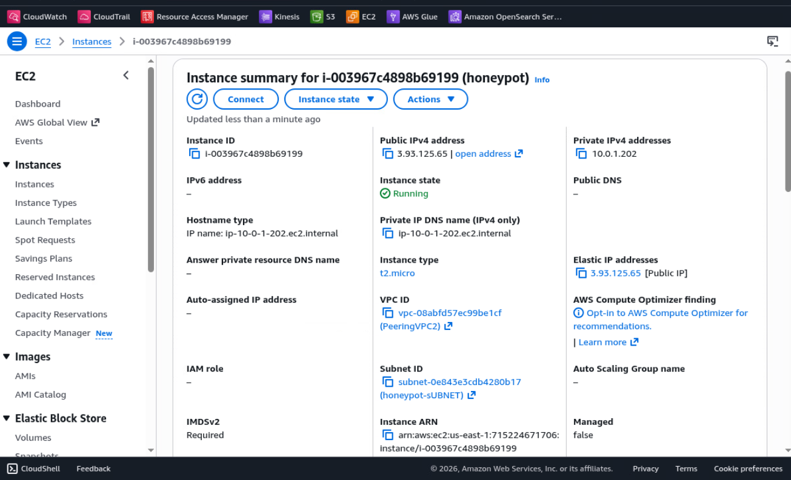
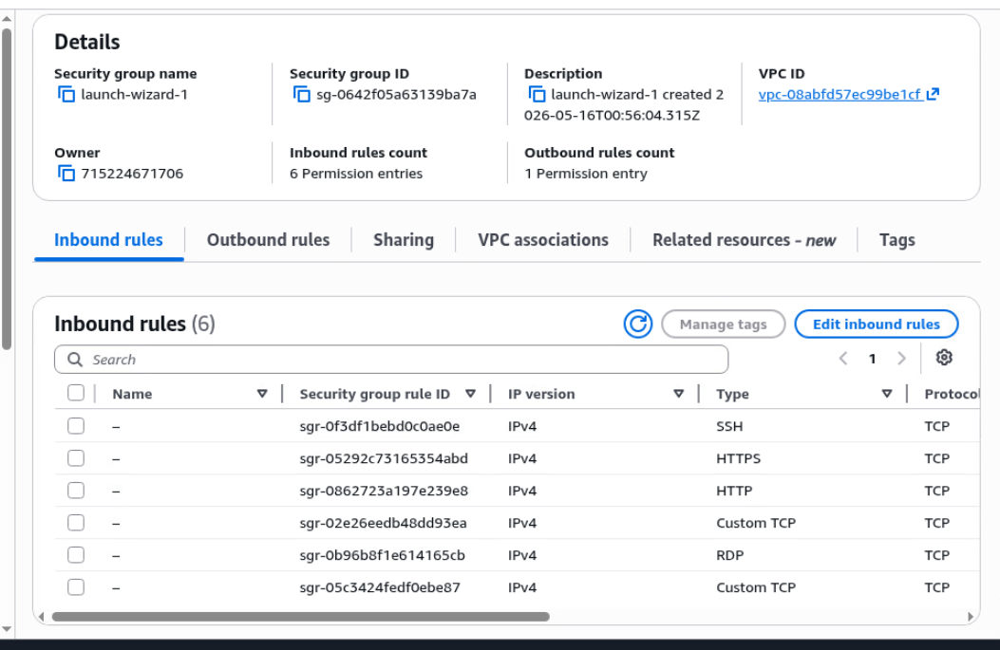
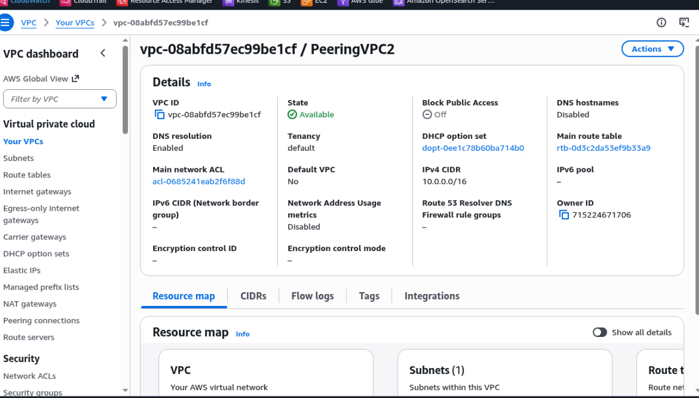
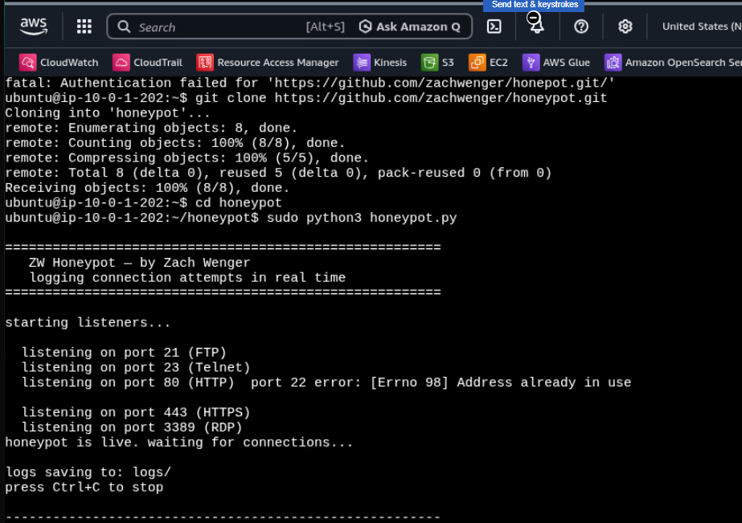
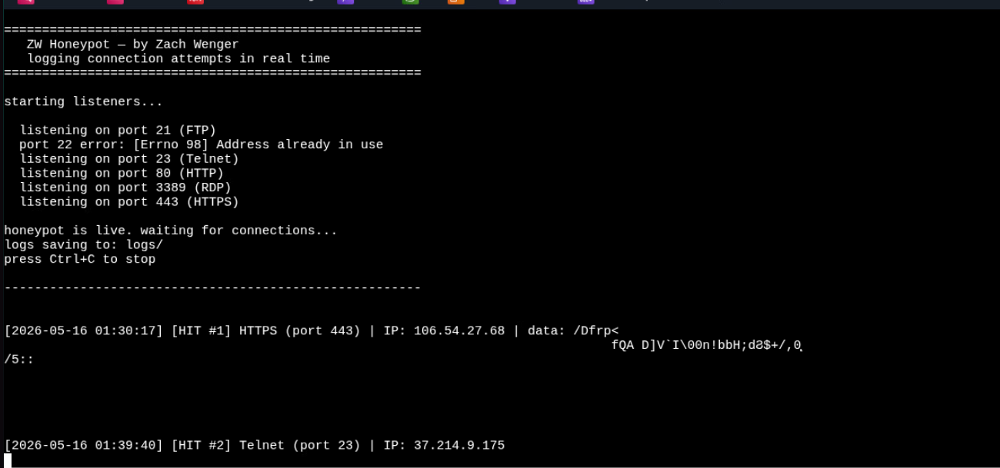
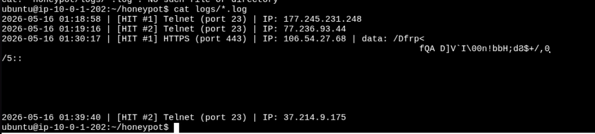

# `● ZW Honeypot`

**Multi-port TCP honeypot deployed on AWS EC2 — captured live internet attack traffic within 60 seconds of going live.**
Built to study real attacker behavior, write the detection logic a SOC team would actually use, and understand how IoT botnets like Mirai still find targets in 2026.

By Zach Wenger · [github.com/zachwenger](https://github.com/zachwenger)

---

## Scenario

I wanted to see what hits an exposed server actually looks like in the wild — not in a textbook, not in a class lab. So I wrote a multi-threaded Python honeypot that pretends to run FTP, SSH, Telnet, HTTP, HTTPS, and RDP, deployed it to a public AWS EC2 instance, and logged every connection.

No IP advertising, no DNS, nothing in any threat-intel feed. Just an Elastic IP and open security groups. The first bot found me in under a minute.

---

## Architecture

```
┌──────────────────────────────────────────────────┐
│  Public internet                                 │
│                                                  │
│  (Botnets · Mirai variants · vuln scanners)      │
└──────────────────────────────────┬───────────────┘
                                   │ unsolicited TCP
                                   ▼
                  ┌────────────────────────────┐
                  │  AWS EC2 t2.micro          │
                  │  Ubuntu Server 22.04       │
                  │  Elastic IP 3.93.125.65    │
                  │  Region us-east-1          │
                  │  ┌──────────────────────┐  │
                  │  │ honeypot.py          │  │
                  │  │ 6 threaded listeners │  │
                  │  │  21 22 23 80 443 3389│  │
                  │  └──────────┬───────────┘  │
                  │             │              │
                  │             ▼              │
                  │  logs/honeypot_*.log       │
                  └────────────────────────────┘
```

| Component | Details |
|---|---|
| Cloud | AWS EC2 |
| Instance | t2.micro (free tier) |
| OS | Ubuntu Server 22.04 LTS |
| Region | `us-east-1` (N. Virginia) |
| Public IP | `3.93.125.65` |
| Listeners | 6 (FTP / SSH / Telnet / HTTP / HTTPS / RDP) |
| Storage | EBS gp3, logs written locally then rotated |





---

## Why these 6 ports

| Port | Service | Why attackers hit it | MITRE ATT&CK |
|---|---|---|---|
| 21 | FTP | Legacy, often misconfigured with anonymous access | T1078 Valid Accounts |
| 22 | SSH | #1 target for credential stuffing + brute force | T1110.001 Brute Force: Password Guessing |
| 23 | Telnet | Default creds on millions of IoT devices — Mirai's vector | T1110.001 + T1078.001 Default Accounts |
| 80 | HTTP | Web vuln scanners, Log4Shell probes, CMS exploits | T1190 Exploit Public-Facing App |
| 443 | HTTPS | SSL/TLS exploits, crafted-handshake exploits | T1190 |
| 3389 | RDP | Ransomware initial-access — Conti / BlackCat / LockBit love this | T1133 External Remote Services |

---

## Live capture results

Live within ~60 seconds. No advertising, no public posting.





### Captured connections (first session)

| # | Time (UTC) | Port | Service | Source IP | Payload | MITRE | Severity |
|---|---|---|---|---|---|---|---|
| 1 | 2026-05-16 01:18:58 | 23 | Telnet | `177.245.231.248` | — | T1110.001 | Info |
| 2 | 2026-05-16 01:19:16 | 23 | Telnet | `77.236.93.44` | — | T1110.001 | Info |
| 3 | 2026-05-16 01:30:17 | 443 | HTTPS | `106.54.27.68` | crafted binary, non-handshake | T1190 | Medium |
| 4 | 2026-05-16 01:39:40 | 23 | Telnet | `37.214.9.175` | — | T1110.001 | Info |

### IOCs (raw, ready to drop into a SIEM)

```
# Telnet scanner cluster
177.245.231.248  - Mexico, residential, Telmex AS8151
77.236.93.44     - Belarus, hosting (Active.by)
37.214.9.175     - Belarus, residential (Beltelecom)

# HTTPS exploit payload sender
106.54.27.68     - China, Tencent Cloud AS45090
```

Three of four IPs trace back to residential / hosting blocks that show up
in public botnet feeds (AbuseIPDB, Spamhaus DROP). The Tencent Cloud one
is more interesting — those tend to be cheap VPS rentals used as
disposable scanner nodes.

---

## Analysis

### Cluster 1 — Telnet brute force sweep `(hits 1, 2, 4)`

Three different IPs hit port 23 in the first 21 minutes. None sent
payload data — they were establishing connection only, which is the
TCP-handshake stage of a wider scan/brute pattern. This is **exactly
the Mirai-family behavior**: scan for open Telnet → fall back to a
hardcoded credential list once a banner is identified.

The Mirai source-code leak (2016) hard-coded ~60 default credentials
including `root/root`, `admin/admin`, `root/xc3511` (Xiongmai DVRs).
Eight years on, derivative botnets (Mozi, Hajime, BotenaGo) still use
the same vector because IoT vendors still ship with these defaults.

**What a SOC would do with this:** alert on any TCP SYN to port 23 from
an internet source on an internal-facing IP, because nothing legitimate
in 2026 should be reaching internal Telnet from the internet.

### Cluster 2 — Crafted HTTPS payload `(hit 3)`

`106.54.27.68` connected to 443 and immediately sent raw binary data —
not a valid TLS ClientHello. Non-printable bytes, no recognizable handshake
header. This is the signature of a vuln scanner probing for:

- Heartbleed-class memory disclosure
- Misconfigured TLS (e.g. SSL v2/v3 fallback)
- Specific CVE checks against the response banner

This is more sophisticated than the Telnet bots — purposeful, payload-bearing,
not just a connection probe.

---

## Detection rules

Real Sigma rules for the patterns observed. Drop into Splunk / Elastic / Sentinel.

### `detections/sigma/telnet-bot-probe.yml`

```yaml
title: Inbound Telnet Connection from Internet (Mirai-class)
id: 7b1f3c5d-4a8e-4d92-8b21-9c2f6d8a1e4b
status: experimental
description: >
  Any inbound TCP connection to port 23 from a non-RFC1918 source is
  suspicious in 2026 — legitimate Telnet usage is functionally extinct.
  Correlates with Mirai/Hajime/Mozi botnet scanning behavior.
author: Zach Wenger
date: 2026/05/16
references:
  - https://attack.mitre.org/techniques/T1110/001/
  - https://krebsonsecurity.com/tag/mirai-botnet/
logsource:
  category: firewall
detection:
  selection:
    dst_port: 23
    src_ip|cidr|not:
      - '10.0.0.0/8'
      - '172.16.0.0/12'
      - '192.168.0.0/16'
  condition: selection
falsepositives:
  - Internal admins using Telnet for legacy hardware (rare, document the exception)
level: medium
tags:
  - attack.initial_access
  - attack.t1110.001
  - attack.t1078.001
```

### `detections/sigma/https-non-handshake-payload.yml`

```yaml
title: HTTPS Port Receives Non-TLS Binary Payload
id: 9a4d2e8f-1c7b-4f6a-b3e5-2d9f8c1a7e6b
status: experimental
description: >
  TCP traffic to 443 that doesn't begin with a TLS ClientHello (first
  byte 0x16 record type) on a server expecting TLS is consistent with
  vulnerability scanners probing for non-TLS responses.
author: Zach Wenger
date: 2026/05/16
logsource:
  category: network_connection
detection:
  selection:
    dst_port: 443
    payload_first_byte|not: '0x16'
    payload_bytes|gte: 4
  condition: selection
falsepositives:
  - Misconfigured clients sending HTTP to HTTPS port (rare, will show 0x47 'GET')
level: medium
tags:
  - attack.reconnaissance
  - attack.t1595.002
```

---

## Remediation — what I'd do as the defender

1. **Close Telnet at the perimeter, full stop.** Drop inbound TCP/23 at the edge firewall. No business case in 2026.
2. **SSH key auth only** on every host facing the internet. Disable password auth in `sshd_config`. Brute force becomes mathematically pointless.
3. **Geo-block at the edge** for any service that doesn't need to be globally reachable — RDP, internal admin panels, etc.
4. **Fail2Ban / CrowdSec** on SSH-facing hosts to auto-ban brute force IPs.
5. **Aggregate AbuseIPDB + Spamhaus DROP** into a blocklist refreshed hourly. Almost every botnet IP shows up there within a day.
6. **Egress filtering** matters too — even if a box gets popped, it can't phone home or scan outward if egress is restricted.

---

## What I learned

The speed was the thing. I'd read about how the internet is constantly scanned, but reading "constantly" is different from watching a real packet land on your fake Telnet listener 47 seconds after `python3 honeypot.py` returned. Mirai went from a textbook concept to a concrete pattern I now recognize on sight.

The HTTPS payload was the most interesting capture. Not a connection probe — actual exploit attempt data. That's the difference between curiosity-traffic and threat-actor-tooling, and it's the kind of thing a SOC analyst learns to triage in their first month.

Cloud networking finally made sense too. Setting up the VPC, subnet, internet gateway, Elastic IP, and security groups from scratch forced the abstractions to stop being opaque. Now when I read "lateral movement via subnet misconfiguration" it actually maps to a thing I built.

---

## Run it yourself

```bash
git clone https://github.com/zachwenger/honeypot.git
cd honeypot
pip3 install colorama
sudo python3 honeypot.py
```

`sudo` is required — ports under 1024 (21, 22, 23, 80, 443) need root.

> **Do not deploy this on production infrastructure.** It's a learning
> tool, not a security product. Use it on an isolated cloud instance
> you can blow away.

---

## Stack

| | |
|---|---|
| Language | Python 3 |
| Concurrency | `threading` (one listener per port) |
| Logging | stdlib `logging` + rotating file output |
| Cloud | AWS EC2 (free tier) |
| Networking | stdlib `socket`, plain TCP, no SSL termination |
| Dependencies | `colorama` only |

---

## File structure

```
honeypot/
├── honeypot.py                                    — the listener
├── README.md                                      — this file
├── logs/                                          — session logs (gitignored in real use)
├── screenshots/                                   — deployment + capture evidence
└── detections/sigma/                              — Sigma rules for the patterns observed
    ├── telnet-bot-probe.yml
    └── https-non-handshake-payload.yml
```

---

*All captured traffic was unsolicited. The instance was deployed on my own AWS account, in an isolated VPC, for educational purposes. No services were impersonated for fraud, no data was relayed, no responses were sent — this honeypot is purely passive.*
